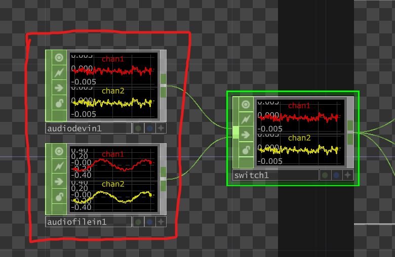
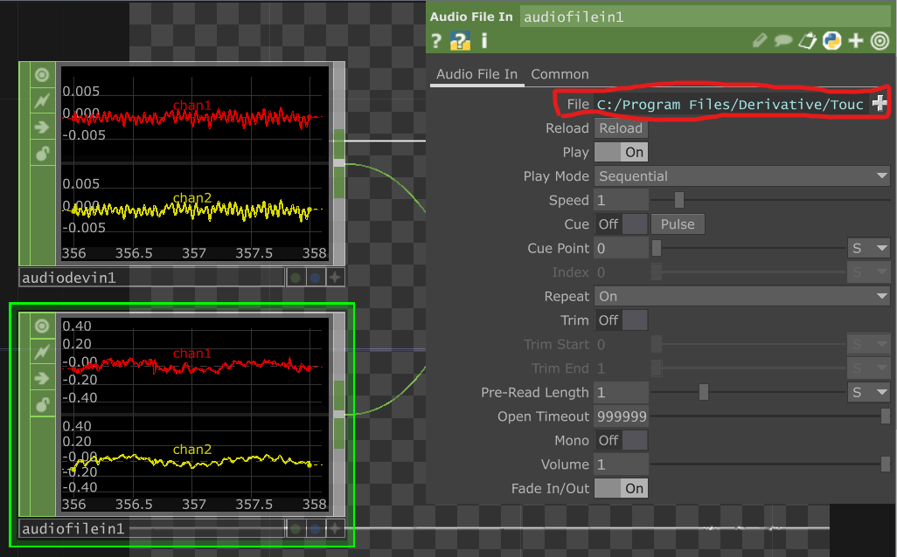
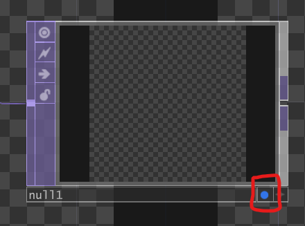
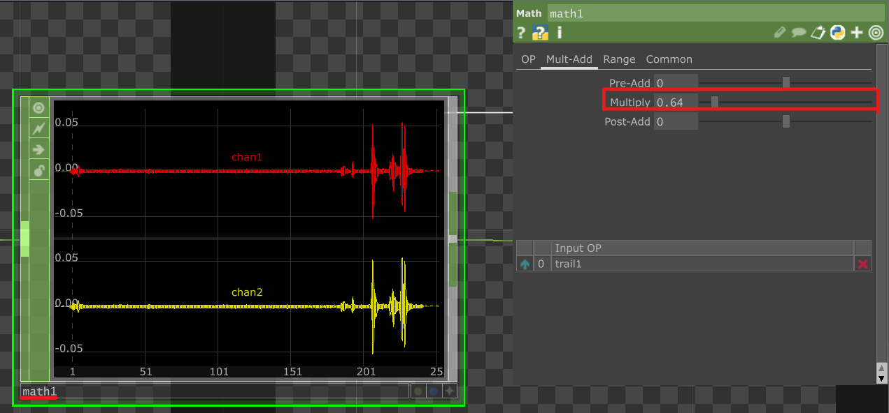
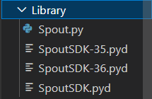
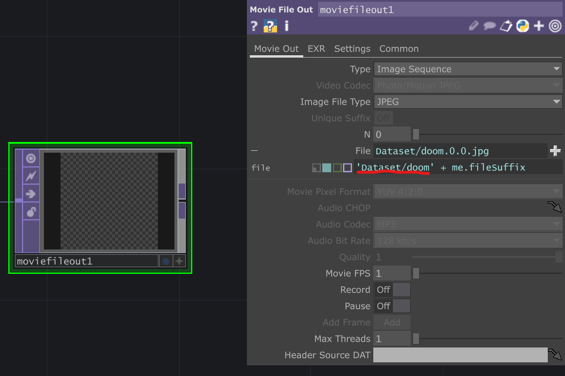
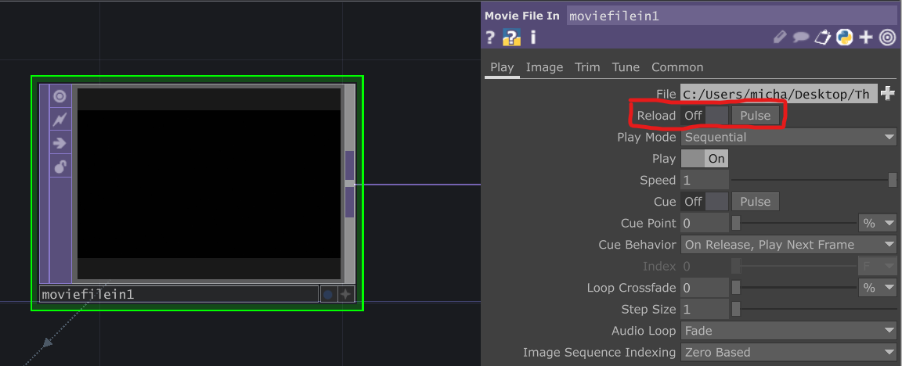
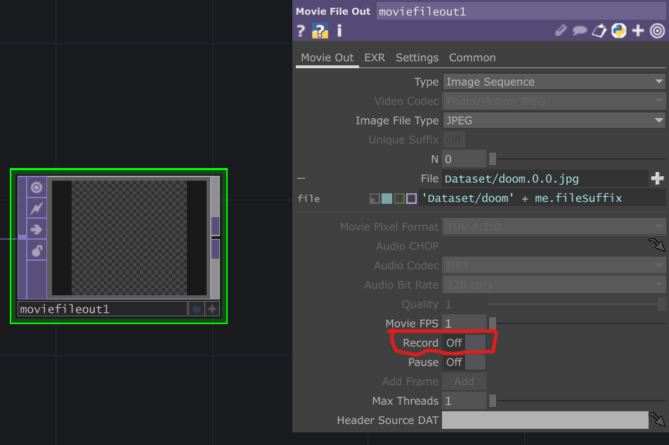

# Digital Creativity
## Audio to Image with pix2pix
By Michael Urlacher

### How to use
In order to run and play with the model, the required Touchdesigner file has to be opened. Open the downloaded *test2.toe* - it only has to be opened, but in the far left, you can change the Audio Input to test different audio.

<br />
Click on either one of the two boxes and select you input device or audio file on the left side of the screen.

<br />
In the Project you can find *test2.bat* which starts the model. The Model is trained on the Doom-Images. <br />
Now, depending on the Audio Input, different Images should appear in *test2.toe*. If they don't on the far right side of *test2.toe* there is a box called "null" and next to the name is a circle to activate the display. <br />

<br />
If the image is not changing, in the post processing part there is a box called *math*. There you can control the multiplier of the Audio, make sure its above **0**.

<br />


### Create Project
#### Prerequisite
For this project an Nvidia GPU with CUDA is needed.
Download <a href="https://developer.nvidia.com/cuda-downloads?target_os=Windows&target_arch=x86_64">CUDA here</a>
or use pix2pix <a href="https://colab.research.google.com/github/junyanz/pytorch-CycleGAN-and-pix2pix/blob/master/pix2pix.ipynb
">Colab Notebook.</a>

#### Preparing the project
Download the pix2pix model from <a href="https://github.com/ML-and-AI-repo/pytorch-CycleGAN-and-pix2pix">junyanz repository</a> or again use the <a href="https://colab.research.google.com/github/junyanz/pytorch-CycleGAN-and-pix2pix/blob/master/pix2pix.ipynb
">Colab Notebook.</a> <br />
In this project the pytorch model will be used. <br />
After downloading the pix2pix model, a specific library is needed for the test later. Download the spout library <a href="https://github.com/Ajasra/Spout-for-Python">here.</a> 


#### Used packages
For the package management I used both Anaconda and pip.
Here is the list that are needed for this project:
<ul>
  <li>!pip install torch torchvision --extra-index-url https://download.pytorch.org/whl/cu117</li>
  <li>!pip install dominate</li>
  <li>!pip install pygame</li>
  <li>!pip install pyopengl</li>
</ul>

**Important**: It is important to notice, that the extra-index-url depends on which CUDA-Version you currently have installed.

#### Setup the project
With conda, go to the root folder of the project and create a conda environment named *pix2pix* with Python 3.7.
```
conda create -n pix2pix python=3.7
```
Activate the environment:
```
activate pix2pix
```
and install all of the previous listed packages.
<br />
<br />
Two major things left to do. <br />
1. Finalise the setup by creating a new test.
2. Create Dataset and train the model.
First create a new folder in the project and name it "Library". In there insert *Spout.py*, *SpoutSDK-35.pyd*, *SpoutSDK-36.pyd* and *SpoutSDK.pyd*.
It should look like this: <br />


#### Create Test
- Copy paste *test.py* and rename it or create a new python file. Mine is called *test2.py*
- Create a .bat file and name it.
In the .bat file copy paste this and change parts to your fits.
```
python test-py-file.py --dataroot ./datasets/folder-name --name name-of-results --model pix2pix --direction AtoB --load_size 512 --crop_size 512
```
Below */datasets/folder-name* make sure to add another folder named *test* and or *train* and insert your dataset in there.  
  
For the last part a certain template is needed. Download *template.py* from this repository, which is a template for the spout library.
In the new python file (test2.py), start by importing all needed imports:
```
import os
from options.test_options import TestOptions
from data import create_dataset
from models import create_model

import sys
sys.path.append('Library')

import numpy as np
import argparse
import time
import SpoutSDK
import pygame
from pygame.locals import *
from OpenGL.GL import *
from OpenGL.GL.framebufferobjects import *
from OpenGL.GLU import *

import torch
```
Then setup the needed functions:
```
def main_pipeline(data, model, dataset):

def main():

if __name__ == '__main__':
    main()
```
Copy and paste the main() function of the template into the test file. Change the option parsing with the original test.py parsing afterwards:
```
def main():
    opt = TestOptions().parse()  # get test options
    # hard-code some parameters for test
    opt.num_threads = 0   # test code only supports num_threads = 0
    opt.batch_size = 1    # test code only supports batch_size = 1
    opt.serial_batches = True  # disable data shuffling; comment this line if results on randomly chosen images are needed.
    opt.no_flip = True    # no flip; comment this line if results on flipped images are needed.
    opt.display_id = -1   # no visdom display; the test code saves the results to a HTML file.
```
Right below is the setup of the model and the part to define the dataset. Add this below the last code block:
```
    dataset = create_dataset(opt)  # create a dataset given opt.dataset_mode and other options
    model = create_model(opt)      # create a model given opt.model and other options
    model.setup(opt)               # regular setup: load and print networks; create schedulers

    for i, data in enumerate(dataset):
        if i >= 1: 
            break
        defdata = data
```
Under window details, change the next lines.
```
    width = 512 
    height = 512 
    display = (width,height)
    
    req_type = 'input-output'
    receiverName = 'input'
    senderName = 'output'
    silent = True
```
Last thing to change in the main function is the output. The main_pipeline functions asks for three parameters, change it accordingly.
```
output = main_pipeline(data, model, defdata)
```
  
  
The main_pipline function handles the data. First we have to get the data of Touchdesigner and convert it in order to use it.
```
    #Spout input data
    data = (data / 255.0) * 2 - 1 #transform data
    data = np.transpose(data, [2, 0, 1]) #change order of data
    data_torch = torch.Tensor([data]) #convert data to the tensor
```
Next, use the data for the model which gives us the results:
```
    dataset['A'] = data_torch
    model.set_input(dataset)               # unpack data from data loader
    model.test()                           # run inference
    visuals = model.get_current_visuals()  # get image results
```
Lastly, we output the results of the visuals. Where also have to change the order of the data:
```
    output = visuals['fake_B'].data.cpu().numpy()
    output = np.transpose(output, [0,2,3,1])[0] #change order of the output

    #convert texture
    output = (output + 1) * 255 / 2

    return output
```
### Train
Before we can train the model, a dataset is needed. This can be done with Touchdesigner, which gives us the possibility to layout our audio and images next to each other.
#### Create Datasets
Open *getdataset2.toe* and to the far left use the preferred Video.  
To the far right, there is a box called moviefileout1. Enter the directory path and give the images a name:
  
Pause Touchdesigner and reset the video:
  
Enable Record and unpause Touchdesigner and let it run through the video. Make sure to stop recording after the video end. Otherwise there will be redundant images.
  

#### Actual training
After getting the dataset, use the <a href="https://colab.research.google.com/github/junyanz/pytorch-CycleGAN-and-pix2pix/blob/master/pix2pix.ipynb#scrollTo=9UkcaFZiyASl">Notebook</a> to train the Model.  
Execute the Install cells and upload the dataset in the directoy */datasets/folder-name/train*.
Change the train cell as needed for the model:
```
!python train.py --dataroot ./datasets/folder-name --name name-of-results --model pix2pix --direction AtoB --display_id -1 --load_size 512 --crop_size 512 --n_epochs 50 --n_epochs_decay 50
```
Execute the cell and after training use the checkpoints in the model.

### Conclusion
This project was fun and I learned a lot. Some problems accured during the process of this project and even after the project I had some ideas to improve the results.
For example: Using slower music and video for training could improve the results, as faster music and video potentially creates overlapping datasets.


### Sources and Thanks
Idea, Help and Sources where found <a href="https://medium.com/@vasily.onl/visualizing-sound-with-ai-e7a9191fea2c">here</a> thanks to Vasily Batin. <br />
Helpful solutions to problems:
- <a href="https://github.com/junyanz/pytorch-CycleGAN-and-pix2pix/commit/9bcef69d5b39385d18afad3d5a839a02ae0b43e7">Attribute Error</a>
- <a href="https://github.com/python-pillow/Pillow/issues/4130#issuecomment-1201516416">Import Error<a/>
